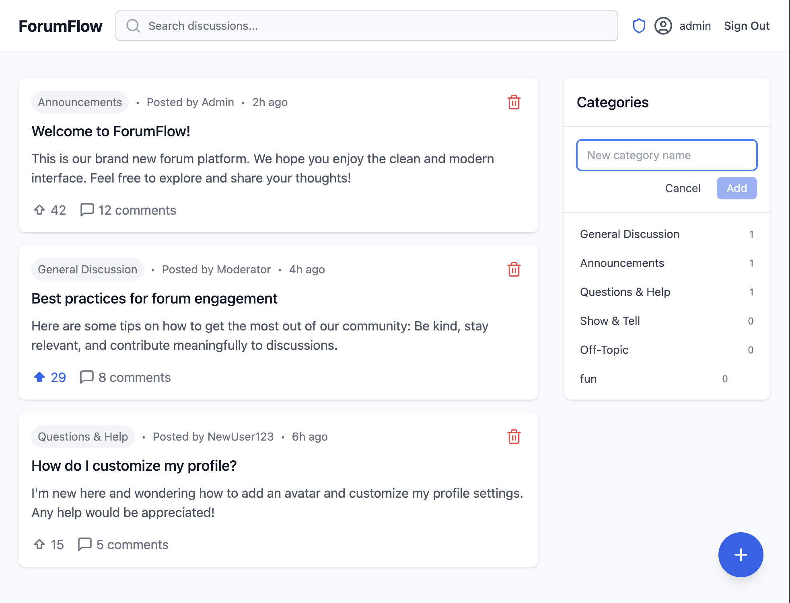
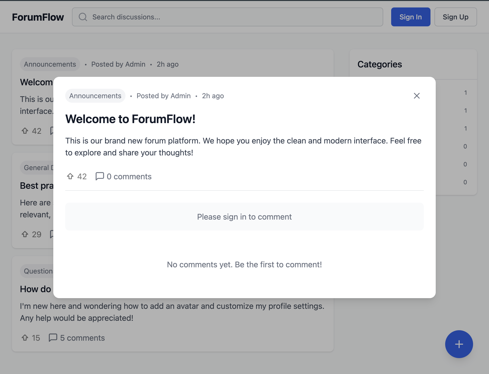

# ForumFlow

ForumFlow is a modern, responsive forum template that can be used and edited by everyone built with React and TypeScript. It provides a clean and intuitive interface for community discussions.

## Tech Stack

- **Frontend Framework:** React 18 with TypeScript
- **Build Tool:** Vite
- **Styling:** Tailwind CSS
- **UI Components:**
  - Headless UI for accessible components
  - Lucide React for icons
- **Type Safety:** TypeScript

## Features

- 📱 Responsive design optimized for all devices
- 🎨 Modern and clean UI inspired by contemporary platforms
- 📑 Filter and organise post by categories
- ⬆️ Upvoting system for posts
- 💬 Comment counter
- 🔍 Search functionality
- 👋 First-time user welcome modal
- 📱 Mobile-friendly floating action button for creating posts as well as commenting
- 👴 Sign-in and Sign-up functions that stores user detail
- 👮‍♀️ Default admin account with features to delete post and add category (admin@admin.com / admin123))
- 🗨️ Threaded comments for organized discussions


## Demo
[Demo Link]https://react-forum-template.vercel.app/
### Screenshot




## Getting Started

### Prerequisites

- Node.js (v16 or higher)
- npm or yarn

### Installation

1. Clone the repository
```bash
git clone https://github.com/PStarH/react-forum-template
cd forumflow
```

2. Install dependencies
```bash
npm install
```

3. Start the development server
```bash
npm run dev
```

The application will start running at `http://localhost:5173`

### Build for Production

```bash
npm run build
```

## Project Structure

```
src/
├── components/ # Reusable UI components
│ ├── CommentInput.tsx
│ ├── CommentThread.tsx
│ ├── CreatePostButton.tsx
│ ├── CreatePostModal.tsx
│ ├── Header.tsx
│ ├── PostCard.tsx
│ ├── PostDialog.tsx
│ ├── Sidebar.tsx
│ ├── SignInModal.tsx
│ ├── SignUpModal.tsx
│ └── WelcomeModal.tsx
├── context/ # Context providers
│ └── AuthContext.tsx
├── types.ts # TypeScript interfaces
├── App.tsx # Main application component
├── main.tsx # Application entry point
└── index.css # Global styles
```

## Contributing

Feel free to submit issues and pull requests to improve the application.

## License

This project is open source and available under the MIT license.
